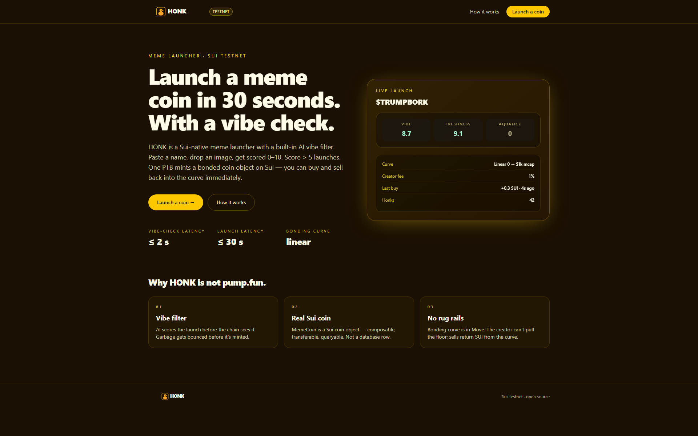
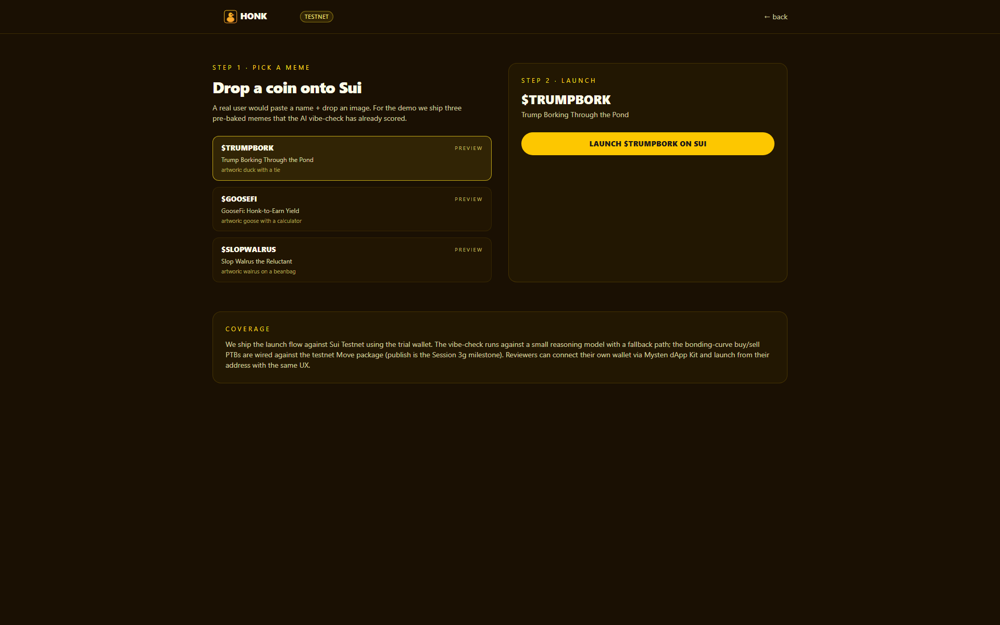

<p align="center">
  
</p>

<p align="center">
  <b>HONK</b> — Launch a Sui meme coin in 30 seconds — with an AI vibe filter.
</p>

<p align="center">
  <a href="https://honk.veithly.workers.dev"></a>
  <a href="https://honk.veithly.workers.dev/app"></a>
  <a href="https://nextjs.org"></a>
  <a href="https://sui.io"></a>
  <a href="./LICENSE"></a>
</p>

<p align="center">
  
</p>

## Why HONK

Meme coin launchers ship in five minutes today, but the hit rate is brutal — most launches are unfunny, derivative, or rug-coded. HONK adds one filter: an AI vibe score. Paste a name, drop an image, get rated 0-10 on humor, originality, and meme-readiness. Score > 5 unlocks the launch button. One PTB mints a bonded curve coin on Sui — buy and sell back into the curve immediately, no DEX listing required.

## What it does

Open the app. Type a meme name, paste a description, drop an image. Click Vibe Check. The reasoning engine returns a structured score with rubric notes — "the cat-with-tie metaphor is overused", "the name pun lands", etc.

If the score breaks 5, the Launch button lights up. Sign one PTB. The coin mints on a bonded curve — initial price 0.001 SUI, slope baked into Move. Buy and sell immediately on the same page; the curve quotes in real time. The trial wallet runs the demo path; connect for real liquidity.

<p align="center">
  
</p>

## Architecture

Next.js 15 + Mysten dApp Kit + a Move-implemented bonded curve. The vibe-check API streams a structured JSON score from the reasoning engine. The launch PTB mints the coin and seeds the curve in one call. Full pipeline in [`docs/ARCHITECTURE.md`](./docs/ARCHITECTURE.md).

## Quick start

```bash
pnpm install
cp .env.example .env.local   # fill SUI_FULLNODE_URL + LLM key (see below)
pnpm dev                     # http://localhost:3180
```

Required env vars:
- `SUI_FULLNODE_URL` — Sui Testnet RPC endpoint (default: `https://fullnode.testnet.sui.io:443`)
- `SUI_DEMO_PRIVATE_KEY` — Ed25519 secret key for the hosted-wallet ("Try instantly") flow. Leave blank to require a connected wallet.
- `STEPFUN_API_KEY` (or `OPENAI_API_KEY`) — reasoning engine key, only required for the AI-driven flows.

Production build + Cloudflare deploy:

```bash
pnpm build
pnpm run deploy   # opennextjs-cloudflare deploy
```

End-to-end smoke test:

```bash
pnpm test:e2e
```

## Tech stack

- **Next.js 15** App Router · React 19 · Tailwind v4 · shadcn/ui base
- **@mysten/dapp-kit-react** for wallet connection + transaction signing
- **@mysten/sui** for PTB construction + RPC
- **OpenNext** for Cloudflare Workers deployment
- **Playwright** for end-to-end test coverage

## License

MIT © veithly
